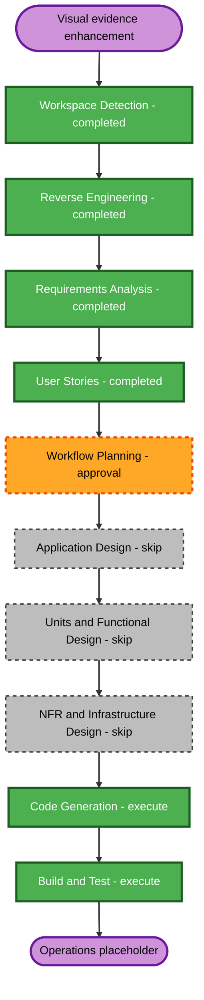

# Visual Storytelling and Evidence Library Execution Plan

## Workflow Planning Checklist

- [x] Load refreshed reverse-engineering artifacts.
- [x] Load approved requirements, clarification answers, personas, and stories.
- [x] Assess transformation scope, affected components, risks, and package coordination.
- [x] Determine which conditional phases add value.
- [x] Validate the Mermaid workflow syntax and provide a text alternative.
- [x] Define the implementation sequence and quality gates.
- [x] Obtain explicit approval of this execution plan.

## Detailed Analysis Summary

### Transformation Scope

- **Transformation type**: Major presentation and content enhancement inside one existing React/Vite package; no deployment-model or infrastructure transformation.
- **Primary changes**: Section composition, an approved owner-supplied profile portrait, approximately five generated editorial image anchors, expanded typed evidence and gallery data, sanitized page assets, page-based document review, sequential gallery lightbox behavior, source disposition documentation, and focused tests.
- **Related components**: Eight medical sections, `EvidenceDocument` and gallery types/data, `DocumentPreviewDialog`, `Lightbox`, media utilities, public assets, medical CSS, privacy tests, accessibility tests, and build documentation.

### Change Impact Assessment

- **User-facing changes**: Yes. All sections gain stronger visual storytelling, and document/gallery review workflows expand.
- **Structural changes**: Minor. Existing component boundaries remain; shared dialogs and types are extended.
- **Data-model changes**: Yes. Evidence needs ordered pages, provenance, publication state, redaction notes, page count, and download policy. Gallery/generated media need explicit source type and disclosure metadata.
- **External API changes**: No. The site remains a static application with no backend.
- **NFR impact**: Yes. Accessibility, privacy, asset performance, responsive behavior, and content integrity require verification.
- **Infrastructure changes**: No. GitHub Actions and GitHub Pages remain unchanged except normal validation of the existing build.

### Component Relationships

- **Primary component**: Medical portfolio React/Vite application.
- **Shared components**: `DocumentPreviewDialog`, `Lightbox`, `SectionShell`, media path helpers, theme controls, and navigation hook.
- **Content components**: Typed evidence, gallery, academics, community-care, identity, contact, research, and section-copy modules.
- **Asset boundary**: Raw CV sources pass through review and sanitization before any derivative reaches `public/` or imported application assets.
- **Supporting components**: Vitest/Testing Library/axe tests, privacy scanning, lint, typecheck, Vite builds, and AI-DLC documentation.

| Area                         | Change type                       | Priority  | Reason                                                      |
| ---------------------------- | --------------------------------- | --------- | ----------------------------------------------------------- |
| Evidence types and data      | Major compatible extension        | Critical  | Enables provenance, states, pages, and downloads            |
| Document review dialog       | Major behavior enhancement        | Critical  | Adds page gallery, navigation, fallback, and focus behavior |
| Gallery lightbox             | Moderate behavior enhancement     | Important | Adds sequential navigation and position feedback            |
| Medical sections and CSS     | Moderate presentation enhancement | Important | Delivers varied layouts and visual anchors                  |
| Public media assets          | Curated expansion                 | Critical  | Adds generated art and safe evidence derivatives            |
| Tests and publication checks | Moderate expansion                | Critical  | Protects privacy, accessibility, and retained behavior      |
| Deployment workflow          | No planned change                 | Optional  | Existing static hosting remains sufficient                  |

### Risk Assessment

- **Risk level**: Medium-high because public evidence preparation can expose personal or third-party information if handled incorrectly.
- **Rollback complexity**: Moderate. Application changes are version-controlled, while public derivatives must also be removed if rejected.
- **Testing complexity**: Complex but bounded to one frontend package, shared dialogs, typed data, assets, and static build output.
- **Primary mitigations**: Source disposition matrix, conservative summary fallback, strict separation of illustration and evidence, optimized assets, focused accessibility/privacy tests, and build-output inspection.

## Phase Decisions

### Inception

- [x] Workspace Detection - completed.
- [x] Reverse Engineering - completed and refreshed for the current medical implementation.
- [x] Requirements Analysis - completed and approved.
- [x] User Stories - completed and approved.
- [ ] Workflow Planning - complete except for owner approval.
- [x] Application Design - SKIP. The work extends the existing medical sections, typed data modules, and shared dialogs; no new service layer or architectural component boundary is required.
- [x] Units Planning - SKIP. The repository is one package and the requested work can be delivered as one coordinated implementation unit.
- [x] Units Generation - SKIP. A separate unit decomposition would duplicate the implementation sequence below without improving ownership or dependency clarity.

### Construction

- [x] Functional Design - SKIP. The approved requirements and stories already specify publication states, navigation behavior, modal behavior, and content-zone rules in testable detail.
- [x] NFR Requirements - SKIP. Accessibility, privacy, performance, maintainability, and verification targets are explicitly approved in the requirements.
- [x] NFR Design - SKIP. Existing axe, privacy, lazy-media, typed-data, and build-validation patterns can be extended directly.
- [x] Infrastructure Design - SKIP. No hosting, networking, backend, storage, secret, or deployment-model change exists.
- [ ] Code Generation - EXECUTE. Create and approve a detailed checkbox plan, then generate assets, code, tests, and implementation records.
- [ ] Build and Test - EXECUTE. Validate typecheck, lint, focused/full tests, accessibility, privacy, media budgets, and root/project-base builds.

### Operations

- [ ] Operations - PLACEHOLDER. The installed workflow does not define deployment execution or monitoring work.

## Workflow Visualization

### Text Alternative

1. Workspace Detection, Reverse Engineering, Requirements Analysis, and User Stories are complete.
2. Workflow Planning is awaiting approval.
3. Application Design, Units Planning/Generation, Functional Design, NFR Requirements/Design, and Infrastructure Design are skipped because the single-package implementation extends established boundaries and approved patterns.
4. Code Generation executes next with planning and generation parts.
5. Build and Test executes after implementation.
6. Operations remains a placeholder.

## Single-Unit Implementation Sequence

1. Audit all CV sources and create the final disposition/public-derivative matrix.
2. Prepare safe sanitized evidence page images and PDFs, using verified summaries where page publication is unsafe.
3. Prepare the approved profile portrait under a neutral filename with metadata removed and responsive optimization.
4. Generate approximately five cohesive editorial/scientific image anchors, inspect them, optimize them, add disclosure metadata, and record prompts/provenance.
5. Extend typed media and evidence contracts, then update identity, evidence, gallery, and section data.
6. Enhance document review with thumbnail selection, full-page images, keyboard navigation, focus behavior, optional PDF actions, and mobile layout.
7. Enhance the gallery lightbox with previous/next navigation, position feedback, keyboard behavior, and focus restoration.
8. Refresh all section/card compositions and integrate relevant imagery without changing the established navigation or theme identity.
9. Add or update component, integration, accessibility, privacy, disclosure, and performance checks.
10. Run the complete build/test matrix and reconcile documentation with measured results.

## Package Coordination

- **Update approach**: Sequential inside one package because public asset paths and typed models must exist before section integration and testing.
- **Critical path**: Source review and derivative preparation, followed by typed models/data, shared dialogs, section integration, and verification.
- **Parallel-safe work**: Generated editorial anchors and sanitized derivative preparation are independent until they enter typed data.
- **Coordination points**: Media base paths, evidence identifiers, page ordering, download policy, modal accessibility behavior, and publication-state labels.
- **Rollback**: Revert code/data changes and remove only newly added reviewed derivatives; raw source files remain untouched.

## Success Criteria and Quality Gates

- Approximately five disclosed editorial image anchors improve hierarchy without appearing as evidence.
- Every substantive CV source has one recorded disposition, and every relevant source group has a safe public representation.
- Multi-page evidence can be reviewed using page images, keyboard navigation, and optional approved PDF controls.
- Gallery navigation is sequential, accessible, and limited to approved low-risk photographs.
- Existing navigation, themes, hashes, CV download, contact placeholders, responsive behavior, and reduced motion remain intact.
- Typecheck, lint, focused and full tests, privacy scans, formatting, asset budgets, and both production builds pass.

## Extension Compliance

- **Security Baseline**: Disabled; skipped. Approved privacy requirements remain ordinary project quality gates.
- **Property-Based Testing**: Disabled; skipped. Focused example-based verification will be used.
