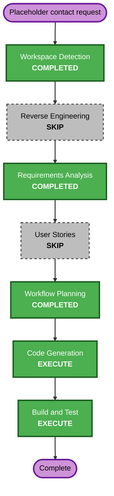

# Placeholder Contact Section Execution Plan

## Detailed Analysis Summary

### Transformation Scope

- **Transformation type**: Single existing-component enhancement.
- **Primary changes**: Extend typed contact content, replace the unfinished notice with a professional contact-information layout, and update focused tests.
- **Related components**: `ContactContent`, `contact` data, `sectionCopy.contact`, `MedicalContact`, and `MedicalContact.test`.

### Change Impact Assessment

- **User-facing changes**: Yes - visitors will see a complete contact presentation with clearly disclosed example values.
- **Structural changes**: No - the existing section, navigation target, and component boundaries remain intact.
- **Data model changes**: Minor - the local `ContactContent` type gains structured placeholder entries and disclosure copy.
- **API changes**: No.
- **NFR impact**: Low - existing responsive, accessibility, and privacy controls are sufficient.

### Component Relationships

- **Primary component**: `MedicalContact`.
- **Source data**: `src/data/contact.ts` constrained by `ContactContent`.
- **Presentation copy**: `src/data/sectionCopy.ts`.
- **Parent integration**: `MedicalShell` renders the unchanged `#contact` destination.
- **Validation**: `MedicalContact.test.tsx` uses the shared accessibility helper.
- **Infrastructure components**: None.

### Risk Assessment

- **Risk level**: Low.
- **Rollback complexity**: Easy; the change is confined to a small set of local files.
- **Testing complexity**: Simple component regression, accessibility, lint, typecheck, and production build.

## Workflow Visualization

### Text Alternative

Workspace Detection, Requirements Analysis, and Workflow Planning are complete. Reverse Engineering and User Stories are skipped. Code Generation and Build and Test execute next, then the workflow closes.

## Phases to Execute

### Inception

- [x] Workspace Detection - completed.
- [x] Reverse Engineering - skipped because current artifacts and focused source inspection are sufficient.
- [x] Requirements Analysis - approved.
- [x] User Stories - skipped because the approved requirements fully specify the small single-component change.
- [x] Workflow Planning - approved on 2026-09-20.
- [x] Application Design - skipped because no new component or service boundary is needed.
- [x] Units Planning - skipped because the implementation is one small unit.
- [x] Units Generation - skipped because decomposition adds no value.

### Construction

- [x] Functional Design - skipped because there is no complex business logic.
- [x] NFR Requirements - skipped because existing accessibility, privacy, and performance requirements are sufficient.
- [x] NFR Design - skipped because no new NFR pattern is needed.
- [x] Infrastructure Design - skipped because hosting and deployment are unchanged.
- [x] Code Generation - completed and approved on 2026-09-20.
- [x] Build and Test - completed on 2026-09-20; awaiting approval to continue to Operations.

### Operations

- [x] Operations - placeholder acknowledged on 2026-09-20; no deployment was authorized or performed.

## Package Change Sequence

1. Update the contact type and typed data contract.
2. Update section copy and `MedicalContact` presentation.
3. Update focused component and accessibility tests.
4. Run typecheck, lint, tests, and production build.

## Success Criteria

- The Contact section has professional structure and coherent responsive styling.
- Email, LinkedIn, and location placeholders are clearly labeled and non-interactive.
- Visitors are warned to replace example information before publication.
- Existing navigation and medical-portfolio styling remain intact.
- Focused tests, accessibility assertions, typecheck, lint, complete test suite, and production build pass.

## Extension Compliance

| Extension              | Status   | Rationale                                                               |
| ---------------------- | -------- | ----------------------------------------------------------------------- |
| Security Baseline      | Disabled | The existing project-level decision is retained.                        |
| Property-Based Testing | N/A      | No pure transformation, serialization, or stateful logic is introduced. |
