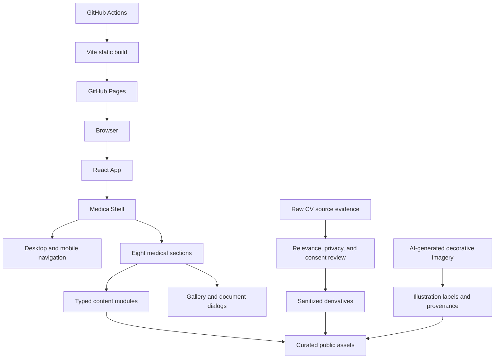
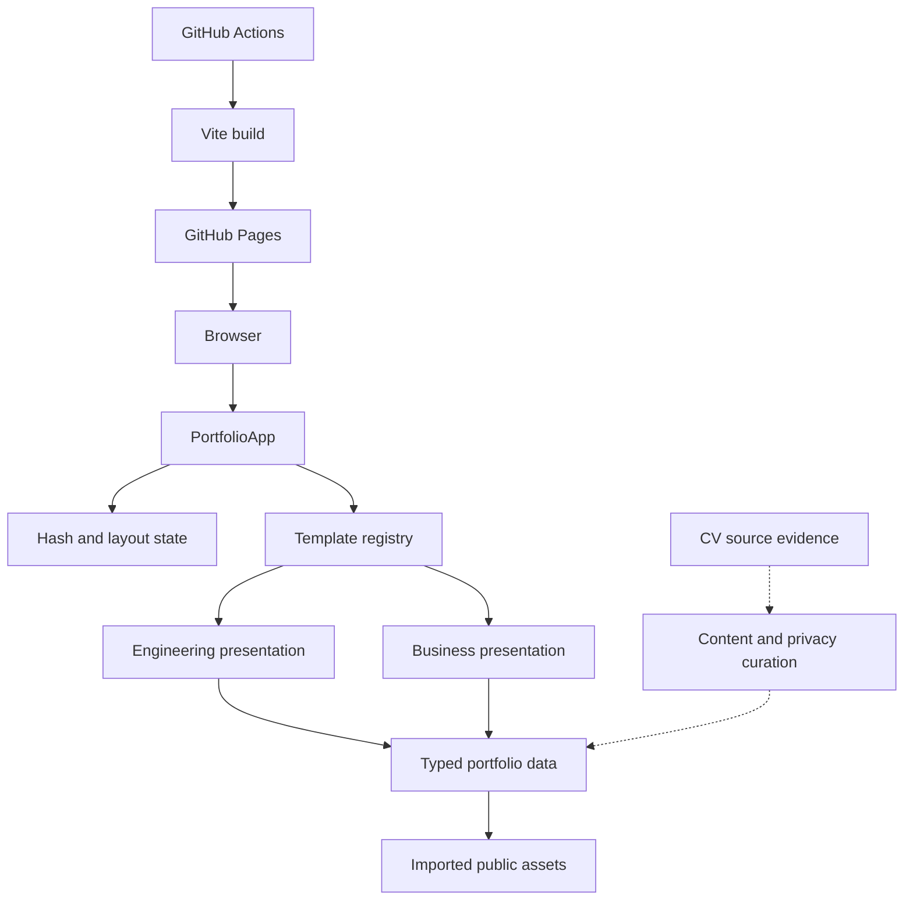
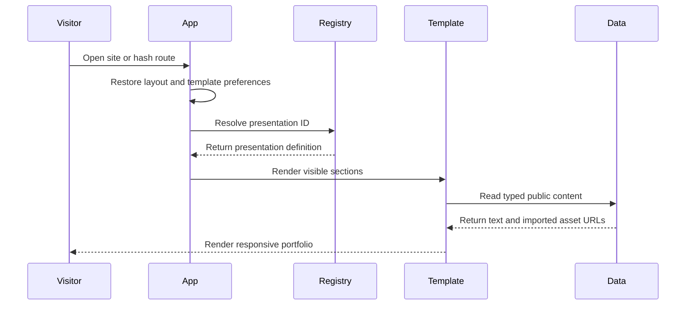

# System Architecture

## 2026-09-26 Current Architecture (Authoritative)

The repository is a single-package React 19 and TypeScript static application built by Vite. `App` renders one `MedicalShell`; the shell owns eight ordered sections plus desktop/mobile navigation and a footer. Typed local data supplies every claim. Curated public images and document thumbnails live under `public/`, while two approved PDFs are imported from `src/assets/documents/`. Raw CV-folder evidence remains outside the runtime dependency graph unless a reviewed derivative is intentionally added.

### Text Alternative

The browser loads the React app and its single medical shell. The shell renders navigation, eight sections, and two reusable dialogs. Sections consume typed data and curated public assets. Raw CV evidence must pass relevance, privacy, and consent review before a sanitized derivative enters the public asset graph. AI-generated imagery follows a separate provenance path and may support presentation but not evidence. GitHub Actions builds and deploys the static output to GitHub Pages.

### Current Architectural Constraints

- No backend, database, authentication, or server-side redaction exists.
- Any imported or public file is shipped to every visitor and must be publication-safe before inclusion.
- `EvidenceDocument` supports one thumbnail and one optional PDF URL; it has no page collection, page count, provenance, redaction status, or preview-mode contract.
- `DocumentPreviewDialog` uses the browser PDF renderer in an iframe and can show an entire approved PDF, but it has no page navigator or image fallback.
- `Lightbox` opens one gallery item at a time and has no next/previous browsing.
- AI-generated assets require a new content/provenance contract so they cannot be confused with source photographs.

> The historical architecture below is superseded where it refers to template selection, Engineering/Business presentations, journal routing, or an unintegrated CV collection.

## System Overview

The repository is a single-package React 19 and TypeScript static portfolio built with Vite. `PortfolioApp` owns template selection, hash-based section routing, local journal routing, and single-page or multi-page layout state. A two-entry template registry renders shared typed portfolio data through Engineering or Business presentations. Chakra UI provides component primitives, CSS variables provide theme tokens, and GitHub Actions publishes the Vite output to GitHub Pages.

The new CV folder is currently an unreferenced source collection. No supplied CV file is included in the production bundle until application code imports it.

## Architecture Diagram

### Text Alternative

The browser loads PortfolioApp. PortfolioApp resolves URL and preference state, chooses one of two registered presentations, and supplies that presentation with typed local content and imported public assets. The CV folder remains outside this data flow until facts and media are curated. GitHub Actions builds the Vite application and deploys it to GitHub Pages.

## Component Descriptions

### Application Package

- **Purpose**: Static student portfolio frontend.
- **Responsibilities**: Resolve visitor state, route sections and journal entries, select a presentation, and render enabled content.
- **Dependencies**: React, Chakra UI, template registry, typed data, browser history, and local storage.
- **Type**: Application.

### Template Registry

- **Purpose**: Provide switchable presentation strategies.
- **Responsibilities**: Register exactly `engineering` and `business`, resolve valid IDs, and fall back to Engineering.
- **Dependencies**: Template definitions and the canonical `SectionId` contract.
- **Type**: Application model.

### Engineering Presentation

- **Purpose**: Provide the baseline technical portfolio presentation.
- **Responsibilities**: Render ten shared section components with a fixed navigation shell and shared light/dark theme.
- **Type**: Presentation.

### Business Presentation

- **Purpose**: Provide an editorial casebook presentation.
- **Responsibilities**: Render a sticky contents rail, dedicated versions of all ten sections, a local journal page, responsive drawer navigation, and a large presentation-specific stylesheet.
- **Type**: Presentation.

### Typed Portfolio Data

- **Purpose**: Centralize student-editable public content.
- **Responsibilities**: Supply profile, section copy, education, experience, awards, projects, gallery, writing, skills, credentials, and navigation configuration.
- **Type**: Local content model.

### CV Evidence Collection

- **Purpose**: Supply source evidence for the requested medical-student narrative.
- **Responsibilities**: Provide academic records, service documents, images, and videos for review.
- **Type**: Unintegrated source assets.

### UI Provider and Shared Utilities

- **Purpose**: Provide color mode, shared cards/actions, toasts, tooltips, media helpers, animations, and navigation utilities.
- **Type**: Shared UI support.

### GitHub Pages Workflow

- **Purpose**: Build and publish the static portfolio.
- **Responsibilities**: Run `npm ci`, derive `VITE_BASE_PATH`, build `dist/`, and deploy the artifact.
- **Type**: Deployment automation.

## Data Flow

### Text Alternative

A visitor opens the site. The app restores safe browser preferences, resolves the URL and template, and renders the visible sections. The selected template reads public typed data and imported asset URLs, then returns the responsive portfolio to the visitor.

## Integration Points

- **External APIs**: None.
- **Databases**: None.
- **Third-party services**: GitHub, GitHub Actions, GitHub Pages, Google Fonts, YouTube embeds, WordPress links, and configured social links.
- **Browser APIs**: History, hash changes, local storage, scrolling, dialogs, media playback, and `mailto:` navigation.
- **Local evidence formats**: PDF, DOCX, JPEG, PNG, and MP4.

## Infrastructure Components

- **CDK, Terraform, or CloudFormation**: None.
- **Deployment model**: Static Vite artifact deployed by GitHub Actions to GitHub Pages.
- **Networking**: Public static hosting with no API server, private network, database, or runtime secret store.
- **Base-path handling**: The workflow uses `/` for a user-site repository and `/{repository}/` for a project site.
