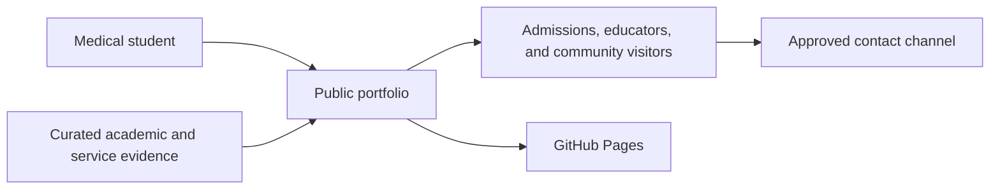

# Business Overview

## 2026-09-26 Current-State Refresh (Authoritative)

The application is now a single medical-student portfolio for Nguyễn Tuấn Gia Linh. Its business purpose is to present academic preparation, scientific curiosity, community service, source evidence, and a privacy-conscious route to future contact. The earlier multi-template engineering/business portfolio described later in this historical artifact no longer exists in runtime code.

### Current Business Transactions

1. **Discover the student** - visitors understand the student's current stage and evidence-led positioning.
2. **Follow the medical journey** - visitors review four chronological milestones ending in medical-program admission.
3. **Review academic preparation** - visitors inspect GPA, IGCSE, A Level, IELTS, Grade 12, recognition, and admission summaries with explicit scales.
4. **Review scientific inquiry** - visitors inspect an educational in-vitro research question, methods, measurements, and limitations.
5. **Review community service** - visitors read collectively attributed service stories and open approved contextual photographs.
6. **Inspect supporting evidence** - visitors view two approved PDFs in a focus-managed popup, download them, and read safe summaries for private records.
7. **Navigate accessibly** - visitors use responsive hash navigation, theme controls, keyboard focus management, and direct section links.
8. **Review placeholder contact channels** - visitors see clearly disclosed example contact details without outbound actions.

### Current Enhancement Opportunity

The content is credible but visually uneven: Gallery and public Evidence cards contain imagery, while most other sections use repeated text cards and icons. The requested enhancement can introduce an editorial image system, richer card compositions, broader safe evidence representation, multi-page previews, and improved popup review. AI imagery must be decorative and labeled as illustration; it must never imply that a generated scene documents the student's real achievements, research, patients, school, or service activity.

> The sections below are retained as historical analysis from the original transformation and are superseded wherever they conflict with this refresh.

## Business Context Diagram

### Text Alternative

The medical student supplies curated academic and community-service evidence. The React portfolio turns that evidence into an accessible public narrative, GitHub Pages publishes it, and visitors can use an approved contact channel without receiving access to sensitive source records.

## Business Description

- **Business purpose**: Present Nguyễn Tuấn Gia Linh as an incoming medical student whose academic preparation, science results, English proficiency, and sustained community service support a credible interest in medicine and patient-centered care.
- **Current implementation**: A reusable student-portfolio template still contains the previous owner's data-engineering identity, two switchable visual themes, ten canonical sections, two layout modes, local journal routing, and GitHub Pages delivery.
- **Requested transformation**: Replace the inherited technology/business presentation and content with one cohesive medicine-themed experience grounded in the supplied `src/assets/CV/` evidence.

## Business Transactions

1. **Discover the student**: A visitor opens the portfolio and quickly understands the student's name, current medical-education milestone, values, and focus.
2. **Review academic preparation**: A visitor explores verified school, IGCSE, IELTS, and university-admission highlights.
3. **Explore service initiatives**: A visitor reviews image-led stories about pediatric hematology support, the rural-school project, and the 2025 Lunar New Year support program.
4. **Inspect supporting evidence safely**: A visitor sees curated facts, captions, and safe media without exposure to government identifiers, home addresses, private phone numbers, bank details, candidate numbers, or full unredacted records.
5. **Navigate responsively**: A visitor moves through the content on mobile or desktop using semantic, keyboard-accessible navigation and direct-link-safe sections.
6. **Contact the student**: A visitor uses only contact details explicitly approved for public use.
7. **Publish updates**: A contributor edits typed local data, verifies the site, and deploys the static build through GitHub Actions and GitHub Pages.

## Business Dictionary

- **Academic preparation**: Evidence from Nguyễn Siêu School, Cambridge IGCSE, IELTS Academic, and the 2026 medical-program admission notice.
- **Medical pathway**: The documented 2026 admission to the Medicine program at the University of Medicine and Pharmacy, Thai Nguyen University.
- **Community care**: Service activities supporting hospitalized children, visually impaired people, Agent Orange-affected families, and children in underserved rural communities.
- **Evidence asset**: A local PDF, DOCX, image, or video supplied under `src/assets/CV/`.
- **Public-safe evidence**: A fact, excerpt, image, or redacted derivative suitable for anonymous web access.
- **Sensitive source record**: Any raw asset exposing protected personal or financial information; such records must not be linked or bundled for public download without redaction and approval.

## Component-Level Business Descriptions

### Application Shell

- **Purpose**: Selects a presentation, resolves URL state, and renders the current content.
- **Responsibilities**: Template choice, section routing, layout mode, journal routing, and visitor preference persistence.

### Portfolio Data Layer

- **Purpose**: Holds the public student story as typed local content.
- **Responsibilities**: Profile, navigation, education, experience, achievements, projects, gallery, journal, skills, certificates, and calls to action.
- **Current gap**: All primary data still describes the previous data engineer and must be replaced.

### Presentation Templates

- **Purpose**: Render the same data through Engineering or Business presentation strategies.
- **Responsibilities**: Navigation, section compositions, light/dark tokens, responsive layout, and interaction styling.
- **Current gap**: Both inherited themes conflict with the requested medical identity and create unnecessary visitor choice for a single-student site.

### CV Evidence Collection

- **Purpose**: Provide verified source material for the new portfolio.
- **Responsibilities**: Support truthful academic and service claims and supply selected visual media.
- **Current gap**: The collection is not yet represented in typed data and includes sensitive records requiring curation.

### Deployment Workflow

- **Purpose**: Publish the static portfolio.
- **Responsibilities**: Install dependencies, derive the GitHub Pages base path, build `dist/`, and deploy through GitHub Actions.
