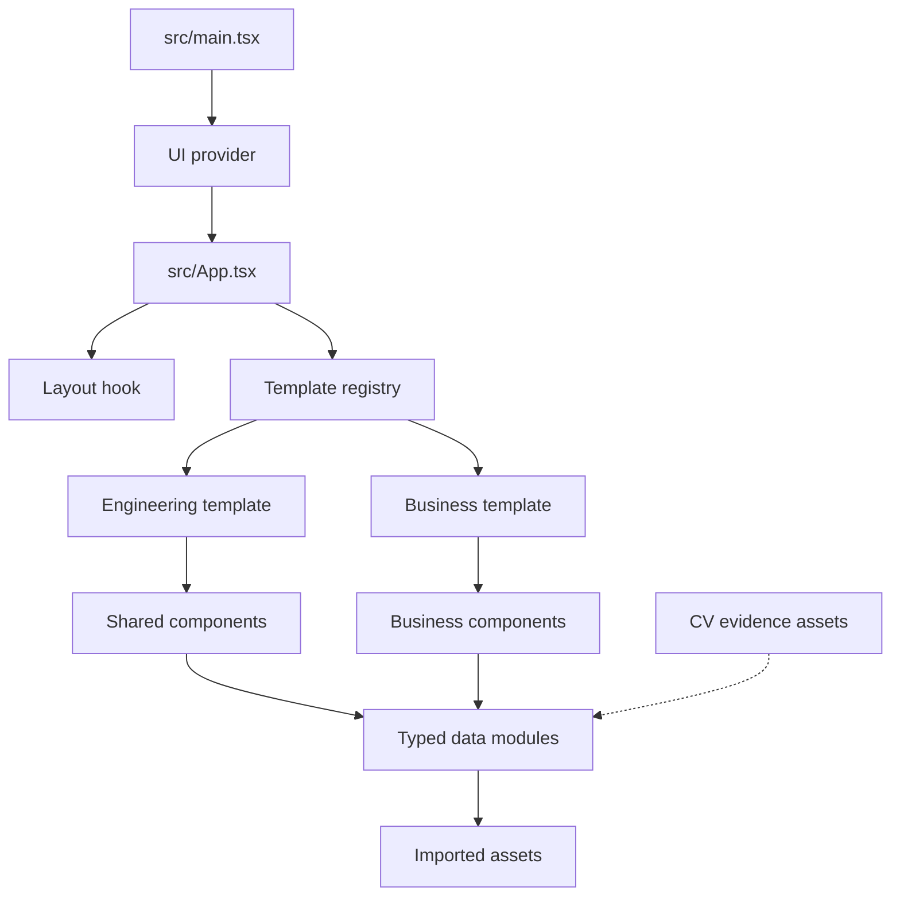

# Code Structure

## 2026-09-26 Current Structure (Authoritative)

- **Entry and provider**: `src/main.tsx`, `src/App.tsx`, and `src/components/ui/provider.tsx`.
- **Application shell**: `src/templates/medical/MedicalShell.tsx` with fixed desktop navigation, mobile drawer navigation, eight sections, and footer.
- **Section components**: Hero, Journey, Academics, Research, Community Care, Gallery, Evidence, and Contact under `src/templates/medical/`.
- **Typed content**: `src/types/medical.ts` plus nine modules under `src/data/`.
- **Media dialogs**: `src/components/ui/lightbox.tsx` and `document-preview-dialog.tsx`.
- **Public media**: nine curated service photos, two first-page document thumbnails, and one site mark under `public/`.
- **Imported public PDFs**: CV and sanitized hematology acknowledgement under `src/assets/documents/`.
- **Private source evidence**: 30 substantive files plus one `.DS_Store` under `src/assets/CV/`.
- **Tests**: 16 Vitest files covering components, shell behavior, navigation properties, score properties, metadata, privacy, theme contracts, and media paths.

### Current Dependency Direction

`App -> MedicalShell -> section components -> typed data/shared UI -> curated assets`. Tests exercise all layers. Raw CV evidence must remain outside this graph until a reviewed derivative is approved.

### Critical Change Surfaces

1. `medical.ts` and `evidence.ts` for multi-page document-preview metadata and provenance.
2. `MedicalEvidence` and `DocumentPreviewDialog` for page thumbnails, popup review, fallbacks, and redaction disclosures.
3. `gallery.ts`, `MedicalGallery`, and `Lightbox` for a larger curated set and sequential browsing.
4. Every non-gallery section for new visual slots and less repetitive card composition.
5. `content-privacy.test.ts`, component tests, asset budgets, and base-path utilities for any new public derivative.
6. `public/` for optimized generated illustrations and reviewed evidence derivatives.

> The module hierarchy below is historical and superseded where it references registries, templates, layouts, or journal modules that have been removed.

## Build System

- **Type**: npm scripts, TypeScript project references, and Vite.
- **Commands**: `npm run dev`, `npm test`, `npm run lint`, `npm run build`, and `npm run preview`.
- **Configuration**: `vite.config.ts`, `tsconfig*.json`, `eslint.config.ts`, `eslint.config.js`, and `package.json`.
- **Deployment**: `.github/workflows/deploy.yml` runs `npm ci`, derives the GitHub Pages base path, builds `dist/`, and deploys it.

## Module Hierarchy

### Text Alternative

`main.tsx` mounts the UI provider and App. App uses the layout hook and template registry. The registry selects Engineering or Business, both of which consume typed data and imported public assets. The new CV evidence is not connected to the data layer yet.

## Existing Files Inventory

### Application and Routing

- `src/main.tsx` - Browser entry point and provider mount.
- `src/App.tsx` - Template selection, hash state, layout routing, journal routing, and section rendering.
- `src/hooks/usePortfolioLayout.ts` - Single-page and multi-page layout persistence and navigation.
- `src/utils/templateSelection.ts` - Template-ID validation and safe local-storage persistence.
- `src/utils/scroll.ts` - Enabled-navigation filtering, active-section tracking, and scrolling.
- `src/utils/journal.ts` - Local journal hash creation and parsing.
- `src/utils/contact.ts` - Contact-form mailto composition.
- `src/utils/media.ts` - Video URL helpers.
- `src/utils/animation.ts` - Reveal-delay class selection.

### Content Model

- `src/types/portfolio.ts` - Canonical section and content contracts.
- `src/data/profile.ts` - Current identity, hero copy, resume, actions, and social links.
- `src/data/navigation.ts` - Ten canonical section IDs and labels.
- `src/data/sectionContent.ts` - Section headings, descriptions, and subsection labels.
- `src/data/about.ts` - Biography and metrics.
- `src/data/education.ts` - Education timeline.
- `src/data/experience.ts` - Work history.
- `src/data/awards.ts` - Awards and recognitions.
- `src/data/projects.ts` - Project cards and outbound actions.
- `src/data/gallery.ts` - Image gallery content.
- `src/data/videos.ts` - Video content.
- `src/data/blog.ts` and `src/data/journalPosts.ts` - External and local writing.
- `src/data/skills.ts` and `src/data/certificates.ts` - Skills and credential previews.
- `src/data/portfolio.ts` - Typed aggregate and exports.
- `src/data/template.ts` - Student-editable default presentation.

### Presentations

- `src/templates/types.ts` - Two-template and shell contracts.
- `src/templates/index.ts` - Registry and fallback behavior.
- `src/templates/options.ts` - Engineering and Business selector metadata.
- `src/templates/engineering/` - Baseline shell and shared-section mapping.
- `src/templates/business/` - Dedicated shell, ten section components, journal page, and tests.
- `src/templates/business/business.css` - 921-line Business design system and responsive rules.
- `src/components/*.tsx` - Baseline Engineering sections and navigation.
- `src/components/shared/*.tsx` - Reusable action, card, logo, selector, and section primitives.
- `src/components/ui/*.tsx` - Chakra provider, color mode, tooltip, toaster, and utilities.
- `src/App.css` and `src/index.css` - Global and Engineering presentation styles.

### Evidence and Static Assets

- `src/assets/CV/` - 30 unintegrated files: five PDFs, two DOCX files, two PNG scans, 19 JPEGs, and two MP4s.
- `src/assets/documents/resume.pdf` - Previous owner's resume.
- `src/assets/certificates/` - Previous owner's eight credential PDFs.
- `src/assets/photo_*`, school logos, and project covers - Previous owner's gallery and project media.

### Tests and Delivery

- `src/App.test.tsx` - App, routing, layout, template, color-mode, and content behavior.
- `src/templates/business/businessTemplate.test.tsx` - Business ownership and truthful-content safeguards.
- `src/templates/templateRegistry.test.ts` - Registry completeness and fallback behavior.
- `src/templates/journalPostPages.test.tsx` - Journal detail behavior.
- `src/hooks/usePortfolioLayout.test.ts` - Layout helper behavior.
- `src/utils/templateSelection.test.ts` - Template persistence behavior.
- `src/test/data/*.test.ts` - Navigation, README, typed content, link, and accessibility assertions.
- `src/themeAccessibility.test.ts` - Palette and presentation regression safeguards.
- `.github/workflows/deploy.yml` - GitHub Pages CI/CD.

## Design Patterns

### Registry and Strategy

- **Location**: `src/templates/`.
- **Purpose**: Swap full presentations over one content model.
- **Implementation**: Each `PortfolioTemplate` supplies its shell, journal page, chapter labels, section map, and optional section-visibility rule.

### Typed Content Configuration

- **Location**: `src/data/` and `src/types/portfolio.ts`.
- **Purpose**: Separate student content from rendering logic.
- **Implementation**: Data objects use TypeScript `satisfies` checks and are aggregated by `portfolio.ts`.

### Static Hash Routing

- **Location**: `src/App.tsx`, `src/hooks/usePortfolioLayout.ts`, and `src/utils/journal.ts`.
- **Purpose**: Support direct section and article links on GitHub Pages without a server router.

### Presentation-Owned Sections

- **Location**: `src/templates/business/`.
- **Purpose**: Let a theme own full compositions instead of only changing colors.
- **Implementation**: Business supplies a component for every canonical section.

## Critical Change Surfaces

- The medical redesign will affect the canonical data model, navigation labels, template registry, shells, most sections, theme CSS, tests, and imported assets.
- Removing the style selector or retiring both inherited themes will require coordinated updates across App, template types, registry, options, persistence utilities, and tests.
- Raw CV documents must stay unimported unless a redacted public derivative is created.
- All inherited identity assets and copy require removal from the runtime bundle and visible experience.
