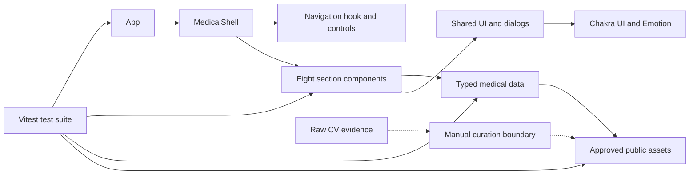
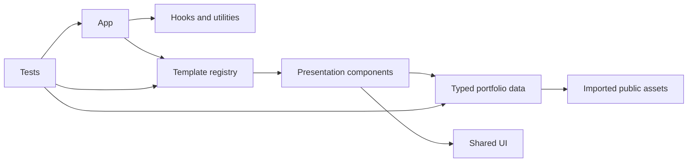

# Dependencies

## 2026-09-26 Current Dependency Graph (Authoritative)

### Text Alternative

App depends on the medical shell. The shell depends on navigation and eight sections. Sections depend on typed data, shared UI, dialogs, and approved public assets. The test suite exercises the application, sections, data, and assets. Raw CV evidence has no direct runtime dependency and may reach public assets only through manual review and sanitization.

### Key Constraints

- Adding a file to `public/` or importing it from `src/` makes it part of the public build.
- More images increase transfer and decoding costs; current policy caps each public gallery or document-thumbnail image at 300KB.
- Browser PDF behavior differs by platform; page-image previews provide a more predictable fallback but increase asset count.
- Generated images must be optimized and tracked separately from documentary images.

> The older registry/template dependency graph below is historical.

## Internal Dependencies

### Text Alternative

App depends on hooks, utilities, and the template registry. Templates depend on presentation components. Components consume typed data, shared UI, and imported assets. Tests exercise the app, templates, and data contracts.

### Key Relationships

- **App depends on templates** - Compile and runtime dependency used to resolve the active presentation.
- **Templates depend on section components** - Compile and runtime dependency used to provide a complete section map.
- **Section components depend on data** - Compile and runtime dependency used to render student content.
- **Data depends on assets** - Build-time dependency causing imported files to be emitted into the public Vite artifact.
- **Tests depend on all layers** - Test-only dependency providing regression safeguards.
- **CV evidence currently depends on nothing** - The directory remains outside the runtime graph until imported.

## External Runtime Dependencies

| Dependency        | Version | Purpose                                  | License |
| ----------------- | ------- | ---------------------------------------- | ------- |
| React / React DOM | 19.2.0  | UI rendering                             | MIT     |
| Chakra UI         | 3.30.0  | UI primitives and responsive composition | MIT     |
| Emotion React     | 11.14.0 | Styling runtime                          | MIT     |
| next-themes       | 0.4.6   | Color-mode state                         | MIT     |
| React Icons       | 5.5.0   | Interface icons                          | MIT     |
| React Markdown    | 10.1.0  | Markdown rendering                       | MIT     |
| Tailwind CSS      | 4.1.18  | CSS build integration                    | MIT     |

## External Development Dependencies

| Dependency            | Version | Purpose                  | License    |
| --------------------- | ------- | ------------------------ | ---------- |
| Vite                  | 7.2.4   | Development and bundling | MIT        |
| TypeScript            | 5.9.x   | Static typing            | Apache-2.0 |
| Vitest                | 4.1.9   | Test runner              | MIT        |
| Testing Library React | 16.3.2  | DOM behavior tests       | MIT        |
| ESLint                | 9.39.2  | Static analysis          | MIT        |
| Prettier              | 3.7.4   | Formatting               | MIT        |

## Dependency Risks

- `node_modules` is absent in the current workspace, so the local test, lint, and build commands cannot run until dependencies are installed.
- The repository contains both `eslint.config.js` and `eslint.config.ts`, which can confuse contributors about the authoritative configuration.
- The presentation selector creates a broad dependency surface for a redesign because IDs are repeated across types, options, registry behavior, persistence, shells, and tests.
- Importing a raw CV file into any data module would make it eligible for inclusion in the public build; privacy review must precede imports.
