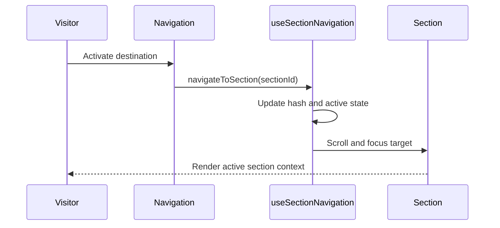
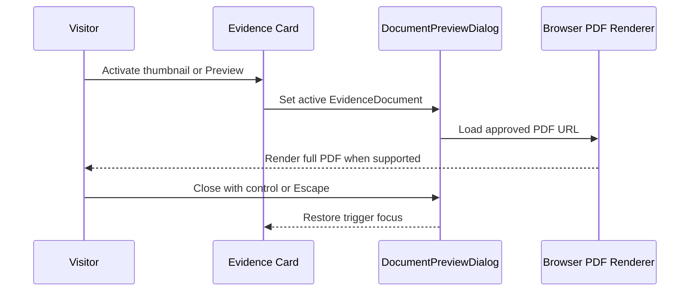
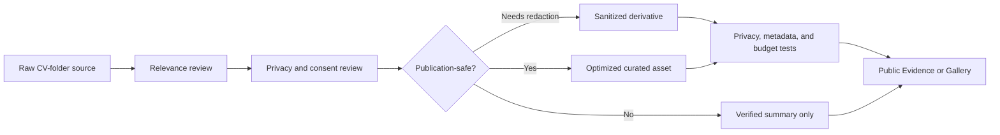

# Interaction Diagrams

## Section Navigation

### Text Alternative

A visitor activates a desktop or mobile destination. The navigation hook validates the section, updates the URL hash and active state, then scrolls and focuses the target section.

## Current Document Preview

### Text Alternative

A visitor activates a public Evidence thumbnail or Preview button. The card supplies one approved document to the dialog, which asks the browser to render the complete PDF. Closing the dialog restores focus. There is no page gallery or image fallback today.

## Evidence Publication Boundary

### Text Alternative

Every raw source passes relevance review and then privacy/consent review. Unsafe originals become verified summaries. Sources needing redaction become sanitized derivatives. Safe sources become optimized curated assets. Derivatives and curated assets must pass privacy, metadata, and performance tests before public inclusion.

## Validation Notes

- Mermaid node identifiers are alphanumeric.
- Labels containing spaces or punctuation are quoted.
- Every diagram has a prose alternative.
